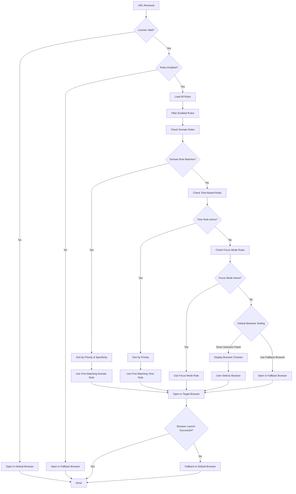

# Proxly Rules and Processing Engine Guide

## Overview

Proxly's rules engine is the heart of the application, intelligently routing URLs to the right browser based on your preferences. This guide explains how rules work, how they're processed, and how you can use them effectively.

## What Are Rules?

Rules are instructions that tell Proxly which browser to use for specific URLs or situations. Think of them as "if-then" statements:

- **If** a URL matches certain criteria
- **Then** open it in a specific browser or browser profile

## Types of Rules

### 1. Domain Rules
**Purpose**: Route URLs based on website domains or URL patterns.

**Examples**:
- Open all GitHub URLs in Chrome
- Open work email (outlook.com) in Edge with work profile
- Open social media sites in Firefox

**How they work**: Proxly examines the URL and matches it against domain patterns you've defined.

### 2. Time-Based Rules
**Purpose**: Route URLs based on the current time and day of the week.

**Examples**:
- Use work browser during business hours (9 AM - 5 PM, weekdays)
- Switch to personal browser in the evenings
- Use a distraction-free browser during focus time

**How they work**: Proxly checks the current time and day against your time-based rules.

### 3. Focus Mode Rules
**Purpose**: Route URLs based on your Mac's Focus Mode status.

**Examples**:
- Use work browser when "Work" focus is active
- Use reading browser when "Do Not Disturb" is active
- Block social media during "Study" focus

**How they work**: Proxly monitors your Mac's Focus Mode and applies appropriate rules.

## Rule Components

Every rule consists of these parts:

### Rule Name
A descriptive name you choose (e.g., "Work Sites - Chrome", "Evening Browsing - Firefox")

### Rule Type
- Domain
- Time-Based  
- Focus Mode

### Condition
The criteria that must be met for the rule to activate:
- **Domain rules**: URL patterns like `github.com` or `*.google.com`
- **Time rules**: Time ranges and days like "9:00-17:00 on weekdays"
- **Focus rules**: Focus mode names like "Work" or "Do Not Disturb"

### Browser Target
Where to open the URL:
- **Browser**: Which application to use (Chrome, Firefox, Safari, etc.)
- **Profile**: Which browser profile to use (optional)
- **Custom Arguments**: Advanced launch options (optional)

### Priority
A number that determines which rule wins when multiple rules could apply (higher numbers = higher priority)

### Enabled/Disabled Status
Whether the rule is currently active

## How the Processing Engine Works

When you click a link or open a URL, here's what happens:



## Rule Priority System

### Overall Priority (Rule Types)
1. **Domain Rules** (Highest Priority)
2. **Time-Based Rules** (Medium Priority)  
3. **Focus Mode Rules** (Lowest Priority)

This means domain rules always win over time-based rules, which win over focus mode rules.

### Within Each Type
Rules are sorted by:
1. **Priority number** (higher numbers first)
2. **Specificity** (more specific patterns first, for domain rules)

### Example Priority Resolution
If you have these rules:
- Domain rule: `github.com` → Chrome (Priority 5)
- Time rule: Work hours → Edge (Priority 8)
- Focus rule: Work focus → Safari (Priority 10)

When you visit `github.com` during work hours with work focus active, the **domain rule wins** because domain rules have the highest type priority.

## Domain Pattern Matching

Domain rules support flexible pattern matching:

### Exact Match
- `github.com` - matches only github.com
- `mail.google.com` - matches only Gmail

### Wildcard Patterns
- `*.github.com` - matches any GitHub subdomain
- `github.com/*` - matches any GitHub page
- `*.google.*` - matches any Google domain

### Advanced Patterns (Regex)
- `/^.*\.(github|gitlab)\.io$/` - matches GitHub or GitLab Pages
- `regex:.*\.(edu|org)$` - matches educational or organization sites

### Pattern Examples
```
Exact: github.com
Wildcard: *.google.com
Path-specific: github.com/mycompany/*
Regex: /^(mail|calendar)\.google\.com$/
```

## Time-Based Rule Matching

Time rules activate when both conditions are met:

### Time Range
- Format: `HH:MM-HH:MM` (24-hour format)
- Examples: `09:00-17:00`, `18:30-23:00`
- Overnight ranges: `22:00-06:00` (10 PM to 6 AM next day)

### Days of Week
- Sunday = 1, Monday = 2, ..., Saturday = 7
- Common patterns:
  - Weekdays: [2,3,4,5,6]
  - Weekends: [1,7]
  - Every day: [1,2,3,4,5,6,7]

## Browser Targets

### Basic Browser Selection
Choose from installed browsers:
- Safari
- Chrome
- Firefox
- Edge
- Brave
- Other installed browsers

### Browser Profiles (Advanced)
For supported browsers, you can specify profiles:
- Chrome: Work profile, Personal profile
- Edge: Work profile, Personal profile
- Firefox: Work profile, Personal profile

### Custom Arguments (Expert)
Advanced users can specify launch arguments:
- Incognito mode
- Specific window sizes
- Custom user data directories

## Best Practices

### Rule Organization

#### Start Simple
1. Create basic domain rules for your most-visited sites
2. Add time-based rules for work/personal separation
3. Experiment with focus mode rules

#### Use Clear Names
- ✅ "Work Sites - Chrome Work Profile"
- ✅ "Social Media - Firefox Personal"
- ❌ "Rule 1", "Test", "Chrome thing"

#### Set Logical Priorities
- **High Priority (8-10)**: Critical work rules
- **Medium Priority (5-7)**: General browsing rules
- **Low Priority (1-4)**: Experimental or fallback rules

### Domain Pattern Strategy

#### Most Specific First
```
Priority 10: github.com/mycompany/* → Work Chrome
Priority 8:  github.com/* → Personal Chrome  
Priority 5:  *.github.com → Firefox
```

#### Use Wildcards Wisely
- `*.google.com` catches all Google services
- `github.com/*` catches all GitHub pages
- Avoid overly broad patterns like `*.*`

### Time Rule Strategy

#### Non-Overlapping Times
```
✅ Work: 09:00-17:00 (weekdays)
✅ Personal: 18:00-23:00 (every day)
✅ Late night: 23:00-07:00 (every day)
```

#### Avoid Conflicts
```
❌ Rule A: 09:00-17:00 (weekdays) → Chrome
❌ Rule B: 10:00-16:00 (weekdays) → Firefox
```

## Troubleshooting Rules

### Rule Not Working?

#### Check Rule Status
- Is the rule enabled?
- Is "Enable Rules" turned on in settings?

#### Check Priority Conflicts
- Is a higher-priority rule overriding it?
- Are domain rules blocking time-based rules?

#### Verify Conditions
- **Domain rules**: Does the pattern actually match the URL?
- **Time rules**: Are you testing during the specified time/days?
- **Focus rules**: Is the focus mode actually active?

### Testing Rules

#### Use the Rule Tester
1. Go to Rules settings
2. Select a rule to test
3. Enter a test URL
4. See if it matches

#### Enable Logging
1. Go to Settings → Logging
2. Enable logging
3. Test your URLs
4. Check logs to see which rules matched

#### Test Patterns
Use Proxly's pattern tester to verify domain patterns work correctly.

## Advanced Scenarios

### Complex Work Setup
```
Priority 10: company-internal.com/* → Work Chrome (Work Profile)
Priority 9:  *.company.com → Work Chrome (Work Profile)  
Priority 8:  github.com/company/* → Work Chrome (Work Profile)
Priority 7:  Time: 09:00-17:00 (weekdays) → Work Chrome
Priority 5:  github.com/* → Personal Chrome
Priority 3:  *.*  → Personal Firefox
```

### Focus-Based Routing
```
Priority 10: Focus "Work" → Work Chrome
Priority 9:  Focus "Study" → Reading Firefox (no extensions)
Priority 8:  Focus "Do Not Disturb" → Safari (minimal distractions)
Priority 5:  Time: 09:00-17:00 → Work Chrome
```

### Development Workflow
```
Priority 10: localhost:* → Development Chrome (Dev Profile)
Priority 9:  *.dev → Development Chrome (Dev Profile)
Priority 8:  github.com/myusername/* → Development Chrome
Priority 7:  stackoverflow.com → Development Firefox
Priority 5:  Time: 09:00-18:00 (weekdays) → Work Chrome
```

## Performance Considerations

### Rule Evaluation Speed
- Domain rules are fastest (simple pattern matching)
- Time rules are very fast (date/time comparison)
- Focus rules are fast (system state check)

### Memory Usage
- Rules are loaded once at startup
- Pattern matching uses cached regex compilation
- Minimal memory overhead per rule

### Best Performance Tips
1. Keep total rules under 50 for optimal performance
2. Use exact matches when possible (faster than wildcards)
3. Avoid overly complex regex patterns
4. Disable unused rules rather than deleting them

## Security and Privacy

### What Rules Can Access
- URL being opened (domain, path, parameters)
- Current time and date
- Mac Focus Mode status
- Installed browser list

### What Rules Cannot Access
- Content of web pages
- Browsing history
- Personal data in browsers
- Other applications' data

### Data Storage
- All rules stored locally on your Mac
- No cloud synchronization by default
- Rules can be exported/imported for backup

## Migration and Backup

### Exporting Rules
1. Go to Rules settings
2. Click "Export Rules"
3. Save to a secure location

### Importing Rules
1. Go to Rules settings  
2. Click "Import Rules"
3. Select your exported file

### Sharing Rules
- Export rules to share with team members
- Import community rule sets
- Create organization-wide rule templates

---

*This guide covers the core concepts of Proxly's rules engine. For specific setup instructions, see our guides on Creating Domain Rules, Setting Up Time-Based Rules, and Managing Browser Profiles.*